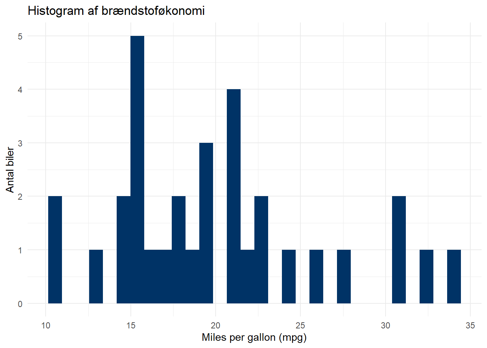
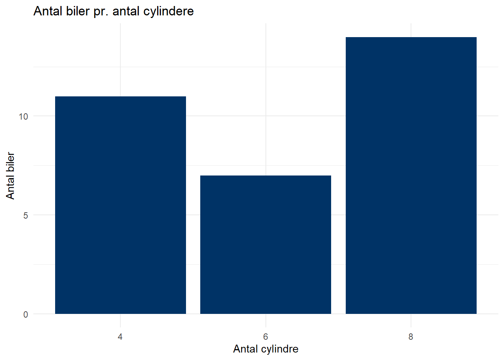
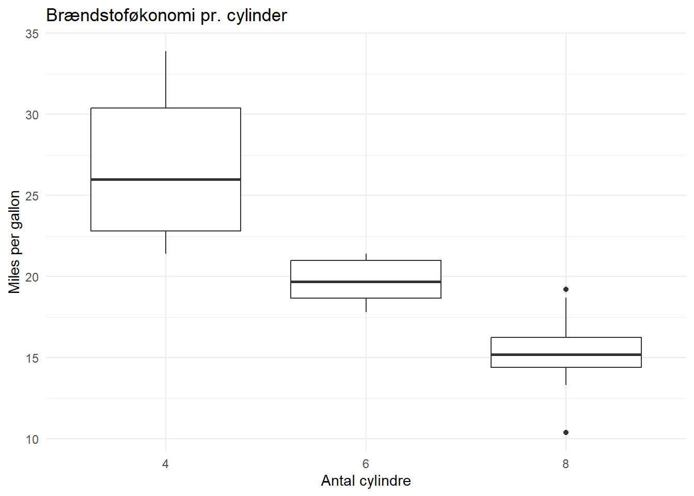
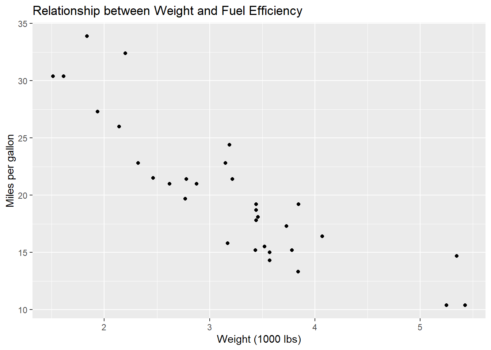

# Introduktion

Dette dokument giver en oversigt over grundlæggende kode og funktioner i R, som vi skal bruge i kurset. Det er en guide, der hjælper dig med at komme i gang med at oprette objekter, indlæse pakker, arbejde med datasæt, lave grundlæggende datavisualiseringer med **ggplot2** og gennemføre de analyser, som vi arbejder med på kurset.

Du vil finde eksempler på, hvordan du kan arbejde med datasæt, omkode variable og lave forskellige typer af plots og analyser, som du kan tilpasse til dine egne data. Brug dokumentet som en opslagsbog, når du skriver din egen kode eller har brug for at forstå, hvordan specifikke funktioner fungerer.

Husk at du kan kopiere koden direkte fra dokumentet og tilpasse den til dine egne opgaver. Der er også inkluderet eksempler på, hvordan du gemmer dine resultater og visualiseringer.

Du kan benytte indholdsoversigten i højre side til at navigere i kodebogen, eller søge efter specifikke ord ved at trykke `Ctrl`+`F` (Windows) eller `Cmd`+`F` (Mac) og skrive et søgeord.

# Objekter

I R er alt, hvad du arbejder med, et objekt. Det kan være tal, tekst, lister eller datasæt. Du opretter objekter, giver dem et navn og kan bruge dem senere.

Du opretter et objekt ved at give det et navn og skrive en pil til højre for navnet, og dernæst definere indholdet af objektet. F.eks. kan vi gemme et objekt, der hedder “mit_foerste_objekt” der indholder teksten “Hello world!”. Vi definerer objektet og dets indhold med en pil


::: {.cell}

```{.r .cell-code}
mit_foerste_objekt <- "Hello world!"
```
:::


Vi kan printe/vise indholdet at objektet ved at køre det i R konsollen eller scriptet:


::: {.cell}

```{.r .cell-code}
mit_foerste_objekt
```

::: {.cell-output .cell-output-stdout}

```
[1] "Hello world!"
```


:::
:::


Du kan naturligvis også gemme tal som objekter...


::: {.cell}

```{.r .cell-code}
mit_tal <- 2
mit_tal
```

::: {.cell-output .cell-output-stdout}

```
[1] 2
```


:::
:::


lave beregninger med dine objekter...


::: {.cell}

```{.r .cell-code}
mit_tal + 2
```

::: {.cell-output .cell-output-stdout}

```
[1] 4
```


:::
:::


og gemme dine resultater i objekter...


::: {.cell}

```{.r .cell-code}
resultat <- mit_tal + 2
resultat
```

::: {.cell-output .cell-output-stdout}

```
[1] 4
```


:::
:::


måske vigtigst af alt kan gemme datasæt (dataframes) i objekter:


::: {.cell}

```{.r .cell-code}
df <- datasæt
```
:::


# Pakker

I R indlæser vi pakker, der indeholder forskellige funktioner. Hver pakken skal installeres én gang, og derefter indlæses hver gang vi åbner R-Studio igen.

## Installér pakker

Pakker installeres direkte i konsollen eller scriptet. Her indlæses f.eks. pakken tidyverse, der indeholder en masse gode data-funktioner:


::: {.cell}

```{.r .cell-code}
install.packages('tidyverse')
```
:::


Man kan også indlæse flere pakker samtidig, f.eks. tidyverse OG janitor, som er god til bl.a. tabeller:


::: {.cell}

```{.r .cell-code}
install.packages(c('tidyverse', 'janitor')) 
```
:::


## Indlæs pakker

Pakker indlæses med funktionen library() i dit script.


::: {.cell}

```{.r .cell-code}
library('tidyverse') 
```
:::


Man kan kun indlæse en enkelt pakke af gangen, med mindre man anskaffer sig en package-manager såsom pacmann. Pacman er selv en pakke, der f.eks. indeholder en funktion `p_load` til at indlæse flere andre pakker på en gang:


::: {.cell}

```{.r .cell-code}
pacman::p_load(tidyverse, janitor)
```
:::


# Datasæt

## Indlæs datasæt

R kan som udgangspunkt kun finde datasæt, der er gemt i samme mappe, som den I arbejder i. Derfor er det smart at gemme sine datasæt og filer i samme mappe, som sit R project.

Hvis du er faret vild kan du bruge funktionen `getwd()` til at printe stien til den mappe, du arbejder i:


::: {.cell}

```{.r .cell-code}
getwd()
```

::: {.cell-output .cell-output-stdout}

```
[1] "C:/Users/mmn/Dropbox/Ilisimatusarfik"
```


:::
:::


For at indlæse datasæt skal I bruge specifikke funktioner, alt efter hvilket filformat datasættet er.

Til excel-filer:


::: {.cell}

```{.r .cell-code}
library(readxl) 
df_excelfil <- read_xlsx("excel_fil.xlsx")
```
:::


Til R-filer:


::: {.cell}

```{.r .cell-code}
df_Rfil <- readRDS("r_fil.rds")
```
:::


Hvis dit datasæt ligger i en undermappe, der hedder data, skal du specificere det i stien:


::: {.cell}

```{.r .cell-code}
df_Rfil <- readRDS("data/r_fil.rds")
```
:::


### Eksempel

Indlæs f.eks. firmadatasættet med funktionen `readRDS` og gem datasættet i et objekt, der hedder `df` (for dataframe):


::: {.cell}

```{.r .cell-code}
df <- readRDS("firma_data.rds")
```
:::


## Åben dataset

Brug `View()` til at åbne datasættet som en tabel


::: {.cell}

```{.r .cell-code}
View(df)
```
:::


Brug `names()` til at printe navnene på variablene i datasættet


::: {.cell}

```{.r .cell-code}
names(df)
```

::: {.cell-output .cell-output-stdout}

```
[1] "navn"        "industri"    "ansatte"     "omsaetning"  "tilfredshed"
```


:::
:::


# Data wrangling

En vigtig fordel i kodebaseret data software er, at vi kan skrive kode, der transformerer vores data til at se ud, præcis som vi vil have det. Det kaldes i folkemunde *data wrangling!*

## Omdøbe variable

Når vi indlæser et datasæt kan det ofte være smart at sørge for, at variablenes navne er ensartede, så programmet kan læse dem. F.eks. er computere sjældent glade for mellemrum og æ,ø,å...


::: {.cell}

:::

::: {.cell}

```{.r .cell-code}
names(df)
```

::: {.cell-output .cell-output-stdout}

```
[1] "køn"                    "tid"                    "Befolkningen.1..januar"
```


:::
:::


Brug `clean_names()` fra pakken `library(janitor)` til at ensarte variablenes navne, når du loader et nyt datasæt:


::: {.cell}

```{.r .cell-code}
library(janitor)
df <- clean_names(df)
names(df)
```

::: {.cell-output .cell-output-stdout}

```
[1] "kon"                   "tid"                   "befolkningen_1_januar"
```


:::
:::


I andre tilfælde vil vi gerne omdøbe variable manuelt. Brug `rename()` fra pakken `library(tidyverse)` til manuelt at omdøbe variable:


::: {.cell}

```{.r .cell-code}
library(tidyverse)
df <- df %>% rename(koen = kon)
names(df)
```

::: {.cell-output .cell-output-stdout}

```
[1] "koen"                  "tid"                   "befolkningen_1_januar"
```


:::
:::


## Omkodning af variable

Man har ofte behov for at omkode/recode sine variable til færre/andre kategorier eller typer. Ofte vil vi gerne omkode mange variable på én gang. Derfor har pakken *dplyr (under tidyverse)* introduceret funktionen `mutate()`.

Logikken er: `mutate(df, ny_variabel = gammel_variabel)`

### Eksempler med European Social Survey

Nedenfor indlæses et udsnit af et datasæt fra European Social Survey med køn, alder, uddannelsesniveau og indkomst:


::: {.cell}

```{.r .cell-code}
df <- readRDS("ESS.rds") 
```
:::

::: {.cell}

:::

::: {.cell}

```{.r .cell-code}
names(df)
```

::: {.cell-output .cell-output-stdout}

```
[1] "koen"         "alder"        "udd"          "net_indkomst"
```


:::
:::


Med `mutate()` kan vi f.eks. tilføje en variabel til vores datasæt, der måler alder kvardreret:


::: {.cell}

```{.r .cell-code}
df <- df %>% mutate(alder2 = alder^2)
```
:::


Udover at omkode variable med matematiske operationer, er det nyttigt at kunne omkode sine variable til nye kategorier på baggrund af forskellige kriterier. I kommer til at stifte bekendtskab med følgende funktione, der skal hjælpe os med at omkode:

-   `mutate()` : hovedfunktionen til at omkode variable
-   `if_else()` : funktion til at implementere én betingelse
-   `case_when()` : funktion til at implementere flere betingelser
-   `fct_recode()` : funktion til specifikt at omkode `factor` variable

`if_else()` kan f.eks. bruges hvis man vil lave en dikotom variabel, der måler, om man er 18 år gammel eller ældre og dermed myndig:


::: {.cell}

```{.r .cell-code}
df <- df %>%
  mutate(myndig = if_else(alder >= 18,
                          "Myndig", # Kategori vis den binære betingelse er sand.
                          "Ikke myndig")) # Kategori hvis den binære betingelse ikke er sand.
```
:::


`case_when` kan også bruges med funktioner, som i eksemplet nedenfor, hvor funktionen `between()`er anvendt til at lave en variabel med alderskategorier:


::: {.cell}

```{.r .cell-code}
df <- df %>%
  mutate(alder_kategori = case_when(
    between(alder, 15, 35) ~ "15-35 år", 
    between(alder, 36, 55) ~ "36-55år ",
    between(alder, 56, 75) ~ "56-75 år",
    alder > 75 ~ "75 +"
  ))
```
:::


Hvis man gerne vil omkode factor variabel kan man bruge funktionen `fct_recode()`. Denne funktion kan også bruges i kombination med mutate.

Logikken er: `fct_recode(variabel, ny_kategori = gammel_kategori)`

F.eks. kan lave en ny variabel for køn, oversat til engelsk med engelske kategorier:


::: {.cell}

```{.r .cell-code}
df <- df %>% mutate(gender = fct_recode(koen, "Male" = "Mand", "Female" = "Kvinde"))
```
:::


## Subsetting

Nogle gange er vi kun interesserede i at arbejde med særlige dele af vores datasæt. Måske er vi f.eks. kun interesseret i to variable fra vores datasæt, eller kun observationer med specifikke værdier på udvalgte variable. I de tilfælde kan vi lave "subsets" af vores datasæt, hvor vi udvælger de specifikke informationer, som vi gerne vil beholde. To nyttige funktioner i arbejde med datasæt/matricer er `select()` og `filter()`

`Select()` funktionen bruges til at udvælge kolonner/variable i datasættet. Hvis man f.eks. kun er interesseret i variablene koen og net_indkomst, kan man pipe sit dataset over i `select()`, vælge variablene og gemme dem i et nyt datasæt:


::: {.cell}

```{.r .cell-code}
ny_df <- df %>% select(koen, net_indkomst)
```
:::


Mens `select()` uvælger kolonner/variable, kan man bruge `filter()` til at vælge rækker/observationer på baggrund af specifikationer. Hvis man f.eks. kun er interesseret i resultater for kvinder i sit datasæt, kan man pipe sit dataset over i `filter()` og dermed kun beholde observationer, der har værdien = "kvinde" på variablen "koen":


::: {.cell}

```{.r .cell-code}
kvinde_df <- df %>% filter(koen=="Kvinde")
```
:::


# ggplot

**ggplot2** er en datavisualiseringspakke i R. Den er bygget på *grammar of graphics* og giver fleksibilitet til at skabe avancerede plots. I skal bruge den til at bygge figurer!

### De tre grundelementer i ggplot2

-   `data`: data, du vil plotte
-   `aes`:kortlægning af variabler (aesthetic mappings)
-   `geom`**:** plot-type, f.eks. søjlediagram, scatterplot, eller boksplot

ggplot2 er som at bygge med LEGO-klodser: Du tilføjer forskellige lag for at skabe det endelige plot. Hvert lag bygger på det forrige og tilføjer nye visuelle elementer. Basen er data, og derfra bygger du videre med lag som akser, farver og geometriske former


::: {.cell}

```{.r .cell-code}
ggplot(data = <DATA>) +
  aes(x = <X-variabel>, y = <Y-variabel>) +
  geom_<GEOM>()
```
:::


### Typer af plots

Der findes mange typer af plots eller ***geoms***, som er gode til forskellige ting. Her er et par grundlæggende:

[Visualisering af én variabel]{.underline}

-   Brug `geom_bar()` til kategoriske variable

-   Brug `geom_histogram()` eller `geom_boxplot` til nummeriske variable

[Visualisering af flere variable]{.underline}

-   Brug `geom_bar()` eller `geom_jitter()` til to kategoriske variable

-   Brug `geom_boxplot` til en nummerisk variabel og en kategoriske variabel.

-   Brug `geom_point()` til to nummeriske variable.

Nedenfor illustreres hver plottype med udgangspunkt i datasættet ***mtcars*** (built in datasæt på biler).


::: {.cell}

```{.r .cell-code}
mtcars
```

::: {.cell-output .cell-output-stdout}

```
                     mpg cyl  disp  hp drat    wt  qsec vs am gear carb
Mazda RX4           21.0   6 160.0 110 3.90 2.620 16.46  0  1    4    4
Mazda RX4 Wag       21.0   6 160.0 110 3.90 2.875 17.02  0  1    4    4
Datsun 710          22.8   4 108.0  93 3.85 2.320 18.61  1  1    4    1
Hornet 4 Drive      21.4   6 258.0 110 3.08 3.215 19.44  1  0    3    1
Hornet Sportabout   18.7   8 360.0 175 3.15 3.440 17.02  0  0    3    2
Valiant             18.1   6 225.0 105 2.76 3.460 20.22  1  0    3    1
Duster 360          14.3   8 360.0 245 3.21 3.570 15.84  0  0    3    4
Merc 240D           24.4   4 146.7  62 3.69 3.190 20.00  1  0    4    2
Merc 230            22.8   4 140.8  95 3.92 3.150 22.90  1  0    4    2
Merc 280            19.2   6 167.6 123 3.92 3.440 18.30  1  0    4    4
Merc 280C           17.8   6 167.6 123 3.92 3.440 18.90  1  0    4    4
Merc 450SE          16.4   8 275.8 180 3.07 4.070 17.40  0  0    3    3
Merc 450SL          17.3   8 275.8 180 3.07 3.730 17.60  0  0    3    3
Merc 450SLC         15.2   8 275.8 180 3.07 3.780 18.00  0  0    3    3
Cadillac Fleetwood  10.4   8 472.0 205 2.93 5.250 17.98  0  0    3    4
Lincoln Continental 10.4   8 460.0 215 3.00 5.424 17.82  0  0    3    4
Chrysler Imperial   14.7   8 440.0 230 3.23 5.345 17.42  0  0    3    4
Fiat 128            32.4   4  78.7  66 4.08 2.200 19.47  1  1    4    1
Honda Civic         30.4   4  75.7  52 4.93 1.615 18.52  1  1    4    2
Toyota Corolla      33.9   4  71.1  65 4.22 1.835 19.90  1  1    4    1
Toyota Corona       21.5   4 120.1  97 3.70 2.465 20.01  1  0    3    1
Dodge Challenger    15.5   8 318.0 150 2.76 3.520 16.87  0  0    3    2
AMC Javelin         15.2   8 304.0 150 3.15 3.435 17.30  0  0    3    2
Camaro Z28          13.3   8 350.0 245 3.73 3.840 15.41  0  0    3    4
Pontiac Firebird    19.2   8 400.0 175 3.08 3.845 17.05  0  0    3    2
Fiat X1-9           27.3   4  79.0  66 4.08 1.935 18.90  1  1    4    1
Porsche 914-2       26.0   4 120.3  91 4.43 2.140 16.70  0  1    5    2
Lotus Europa        30.4   4  95.1 113 3.77 1.513 16.90  1  1    5    2
Ford Pantera L      15.8   8 351.0 264 4.22 3.170 14.50  0  1    5    4
Ferrari Dino        19.7   6 145.0 175 3.62 2.770 15.50  0  1    5    6
Maserati Bora       15.0   8 301.0 335 3.54 3.570 14.60  0  1    5    8
Volvo 142E          21.4   4 121.0 109 4.11 2.780 18.60  1  1    4    2
```


:::
:::


#### Barplot (univariat)

Variablen **cyl** (antal cylindre), som er en kategorisk variabel, kan visualiseres via. et barplot:


::: {.cell}

```{.r .cell-code}
library(ggplot2)

ggplot(mtcars) +
  aes(x = factor(cyl)) +  # Omform cyl til en kategorisk variabel
  geom_bar(fill = "#003366") +
  labs(
    title = "Antal biler pr. antal cylindere",
    x = "Antal cylindre",
    y = "Antal biler"
  ) +
  theme_minimal()
```

::: {.cell-output-display}
{width=672}
:::
:::


#### Histogram (univariat)

Variablen **mpg** (miles per gallon), som er en numerisk, kan visualiseres via. et histogram:


::: {.cell}

```{.r .cell-code}
library(ggplot2)

ggplot(mtcars) +
  aes(x = mpg) +
  geom_histogram(fill = "#003366") +
  labs(
    title = "Histogram af brændstoføkonomi",
    x = "Miles per gallon (mpg)",
    y = "Antal biler"
  ) +
  theme_minimal()
```

::: {.cell-output .cell-output-stderr}

```
`stat_bin()` using `bins = 30`. Pick better value with `binwidth`.
```


:::

::: {.cell-output-display}
{width=672}
:::
:::


#### Boksplot (univariat)

Variablen **mpg** (miles per gallon), som er en numerisk, kan også visualiseres via. et boksplot:


::: {.cell}

```{.r .cell-code}
ggplot(mtcars) +
  aes(x = "", y = mpg) +  # "" for at undgå en x-akse kategori, og y for at angive mpg
  geom_boxplot(fill = "#003366", color = "black") +  # Ændring af farver
  labs(
    title = "Boksplot af brændstoføkonomi",
    x = "",  # Tomt for at undgå en x-akse etiket
    y = "Miles per gallon (mpg)"
  ) +
  theme_minimal()
```

::: {.cell-output-display}
{width=672}
:::
:::


#### Barplot (bivariat)

Vi kan visualisere sammenhængen mellem variablene **cyl** (antal cylindre) og **gear** (antal gear), som begge er kategoriske variabler via `barplot()`:


::: {.cell}

```{.r .cell-code}
library(ggplot2)

ggplot(mtcars) +
  aes(x = factor(cyl), fill = factor(gear)) +
  geom_bar(position = "dodge") +
  labs(
    title = "Fordeling af biler pr. cylinder og gear",
    x = "Antal cylindre",
    y = "Antal biler",
    fill = "Antal gear"
  ) +
  theme_minimal()
```

::: {.cell-output-display}
{width=672}
:::
:::


#### Scatterplot (bivariat)

Vi kan også visualisere sammenhængen mellem **cyl** (antal cylindre) og **gear** (antal gear) via `geom_jitter()`. Et jitter-plot er en variant af et scatterplot, hvor punkterne bliver "spredt" (jittered) lidt tilfældigt, når de overlapper hinanden:


::: {.cell}

```{.r .cell-code}
library(ggplot2)

ggplot(mtcars) +
  aes(x = factor(cyl), y = factor(gear)) +
  geom_jitter(width = 0.2, height = 0.2) +
  labs(
    title = "Spredning af biler mellem cylinder og gear",
    x = "Antal cylindre",
    y = "Antal gear"
  ) 
```

::: {.cell-output-display}
{width=672}
:::
:::


#### Boksplot (bivariat)

Vi kan bruge et boksplot til at se fordelingen af variablene **mpg** (nummerisk) over **cyl** (kategorisk):


::: {.cell}

```{.r .cell-code}
library(ggplot2)

ggplot(mtcars) +
  aes(x = factor(cyl), y = mpg) +
  geom_boxplot() +
  labs(
    title = "Brændstoføkonomi pr. cylinder",
    x = "Antal cylindre",
    y = "Miles per gallon"
  ) +
  theme_minimal()
```

::: {.cell-output-display}
{width=672}
:::
:::


#### Scatterplot (bivariat)

Og vi kan bruge et scatterplot til at se sammenhængen mellem variablene **wt** (vægt) og **mpg** (miles per gallon), som begge er numeriske variabler med `geom_point()`:


::: {.cell}

```{.r .cell-code}
library(ggplot2)

ggplot(mtcars) +
  aes(x = wt, y = mpg) +
  geom_point() +
  labs(
    title = "Sammenhæng mellem vægt og brændstoføkonomi",
    x = "Vægt (1000 lbs)",
    y = "Miles per gallon"
  ) +
  theme_minimal()
```

::: {.cell-output-display}
{width=672}
:::
:::


#### Scatterplot (bivariat) med regressionslinje

Det er også muligt at lægge flere plots ovenpå hinanden med ggplot. F.eks. kan I lægge en regressionslinje indover jeres scatterplot med `geom_smooth()` :


::: {.cell}

```{.r .cell-code}
library(ggplot2)

ggplot(mtcars) +
  aes(x = wt, y = mpg) +
  geom_point() +
  geom_smooth(method = "lm", color = "blue", se = FALSE) +  # Tilføjer en lineær regressionslinje
  labs(
    title = "Sammenhæng mellem vægt og brændstoføkonomi",
    x = "Vægt (1000 lbs)",
    y = "Miles per gallon"
  ) +
  theme_minimal()
```

::: {.cell-output .cell-output-stderr}

```
`geom_smooth()` using formula = 'y ~ x'
```


:::

::: {.cell-output-display}
{width=672}
:::
:::


## Ændring af plot-udseende

ggplots kan nemt ændres ved at tilføje elementer til graferne (ligesom LEGO-klodser). Nedenfor illustreres et par typiske ændringer, med udgangspunkt i et simpelt plot, der kortlægger variablene **wt** (vægt) til x-aksen og **mpg** (miles per gallon) til y-aksen:


::: {.cell}

```{.r .cell-code}
library(ggplot2)

ggplot(data = mtcars) +
  aes(x = wt, y = mpg) +
  geom_point()
```

::: {.cell-output-display}
{width=672}
:::
:::


Man kan bruge funktionen `labs()` til at tilføje titel og asketitler:


::: {.cell}

```{.r .cell-code}
library(ggplot2)

ggplot(data = mtcars) +
  aes(x = wt, y = mpg) +
  geom_point() +
  labs(
    title = "Relationship between Weight and Fuel Efficiency",
    x = "Weight (1000 lbs)",
    y = "Miles per gallon"
  )
```

::: {.cell-output-display}
{width=672}
:::
:::


Man kan ændre dine plots visuelle udseende med `themes()`. Man kan f.eks. ændre baggrunde, akser, tekst, grids, osv., ved at bruge forskellige temaer ggplot2 kommer med flere indbyggede temaer, f.eks. `theme_minimal():`


::: {.cell}

```{.r .cell-code}
library(ggplot2)

ggplot(data = mtcars) +
  aes(x = wt, y = mpg) +
  geom_point() +
  labs(
    title = "Relationship between Weight and Fuel Efficiency",
    x = "Weight (1000 lbs)",
    y = "Miles per gallon") +
  theme_minimal()
```

::: {.cell-output-display}
{width=672}
:::
:::


Det er ofte nødvendigt at skrue på værdierne på akserne. Afhængigt af hvilken akse man vil justere bruger man:

-   `scale_x_discrete()`: Bruges til diskrete (kategoriske) værdier på x-aksen

-   `scale_x_continuous()`: Bruges til kontinuære (numeriske) værdier på x-aksen

-   `scale_y_discrete()`: Bruges til diskrete værdier på y-aksen

-   `scale_y_continuous()`: Bruges til kontinuære værdier på y-aksen.


::: {.cell}

```{.r .cell-code}
library(ggplot2)

ggplot(data = mtcars) +
  aes(x = wt, y = mpg) +
  geom_point() +
  labs(
    title = "Relationship between Weight and Fuel Efficiency",
    x = "Weight (1000 lbs)",
    y = "Miles per gallon") +
  theme_minimal()+
  scale_x_continuous(limits = c(1, 6), breaks = seq(1, 6, by = 1)) +
  scale_y_continuous(limits = c(0, 40), breaks = seq(0, 40, by = 5)) 
```

::: {.cell-output-display}
{width=672}
:::
:::


Man kan også ændre farver på sine ggplots. Afhængigt af hvilken type geometrisk objekt du arbejder med, bruger man `fill()` eller `color()`. **`color()`** ændrer kantfarver og punktfarver, `fill()` ændrer fyldfarver på objekter, der har en indre fyldning. I et scatterplot med punkter bruges `color()`:


::: {.cell}

```{.r .cell-code}
library(ggplot2)

ggplot(data = mtcars) +
  aes(x = wt, y = mpg) +
  geom_point(color="purple") +
  labs(
    title = "Relationship between Weight and Fuel Efficiency",
    x = "Weight (1000 lbs)",
    y = "Miles per gallon") +
  theme_minimal()+
  scale_x_continuous(limits = c(1, 6), breaks = seq(1, 6, by = 1)) +
  scale_y_continuous(limits = c(0, 40), breaks = seq(0, 40, by = 5)) 
```

::: {.cell-output-display}
{width=672}
:::
:::


Man kan ændre tekst-størrelsen på plottets elementer med `theme()`:


::: {.cell}

```{.r .cell-code}
library(ggplot2)

ggplot(data = mtcars) +
  aes(x = wt, y = mpg) +
  geom_point(color="purple") +
  labs(
    title = "Relationship between Weight and Fuel Efficiency",
    x = "Weight (1000 lbs)",
    y = "Miles per gallon"
  ) +
  theme_minimal() +
  scale_x_continuous(limits = c(1, 6), breaks = seq(1, 6, by = 1)) +
  scale_y_continuous(limits = c(0, 40), breaks = seq(0, 40, by = 5))+
  theme(
    plot.title = element_text(size = 18),          # Ændrer titelstørrelsen
    axis.title.x = element_text(size = 14),        # Ændrer størrelsen på x-aksetitlen
    axis.title.y = element_text(size = 14),        # Ændrer størrelsen på y-aksetitlen
    axis.text.x = element_text(size = 12),         # Ændrer størrelsen på x-akse tekst (ticks)
    axis.text.y = element_text(size = 12))          # Ændrer størrelsen på y-akse tekst (ticks)
```

::: {.cell-output-display}
{width=672}
:::
:::


Nogle gange kan det også være nyttigt at rotere sit plot med `coord_flip()`:


::: {.cell}

```{.r .cell-code}
library(ggplot2)
ggplot(data = mtcars) +
  aes(x = wt, y = mpg) +
  geom_point(color="purple") +
  labs(
    title = "Relationship between Weight and Fuel Efficiency",
    x = "Weight (1000 lbs)",
    y = "Miles per gallon"
  ) +
  theme_minimal() +
  scale_x_continuous(limits = c(1, 6), breaks = seq(1, 6, by = 1)) +
  scale_y_continuous(limits = c(0, 40), breaks = seq(0, 40, by = 5))+
  theme(
    plot.title = element_text(size = 18),          # Ændrer titelstørrelsen
    axis.title.x = element_text(size = 14),        # Ændrer størrelsen på x-aksetitlen
    axis.title.y = element_text(size = 14),        # Ændrer størrelsen på y-aksetitlen
    axis.text.x = element_text(size = 12),         # Ændrer størrelsen på x-akse tekst (ticks)
    axis.text.y = element_text(size = 12)) +  # Ændrer størrelsen på y-akse tekst (ticks) 
  coord_flip() # Roterer akserne
```

::: {.cell-output-display}
{width=672}
:::
:::


## Gem dit ggplot

Standardmetoden til at gemme ggplot-grafer er ved hjælp af `ggsave()` funktionen. Først gemmes dit plot som et objekt, dernæst bruges `ggsave()` med følgende syntaks:


::: {.cell}

```{.r .cell-code}
ggsave("mit_plot.jpeg", plot = mit_ggplot_objekt, width = 10, height = 8)
```
:::


-   `mit_ggplot_objekt` er navnet på det objekt, du har gemt dit plot i

-   `ggsave()` kan gemme i forskellige filformater: JPEG, PNG, PDF, TIFF osv.

-   Gem som udgangspunkt i JPEG

-   Juster størrelse med `width` og `height` (i tommer).

Medmindre du specificerer en anden lokation på computeren gemmes plottet i den mappe, som du arbejder i (tjek evt. med `getwd()`).

# Univariat analyse

## Tabeller

Brug funktionen `tabyl()` fra pakken `janitor` til at lave tabeller. Du kan f.eks. lave en envejstabel med frekvenser og andele på variablen **udd** fra ESS datasættet således:


::: {.cell}

```{.r .cell-code}
library(janitor) 
tabyl(df, udd)
```

::: {.cell-output .cell-output-stdout}

```
                         udd    n     percent valid_percent
                  Grundskole 3087 0.223711863     0.2258230
 Ungdoms-/erhvervsuddannelse 4501 0.326183057     0.3292612
     Mellemlang videregående 3934 0.285093123     0.2877835
           Lang videregående 2148 0.155663454     0.1571324
                        <NA>  129 0.009348504            NA
```


:::
:::


Du kan eksportere din tabel til Excel med `writexl`-pakken ved at gemme tabellen i et objekt og bruge funktionen `write_xlxs()`:


::: {.cell}

```{.r .cell-code}
min_tabel <- tabyl(df, udd)

library(writexl)
write_xlsx(list("Min tabel" = min_tabel), "min_tabel.xlsx")
```
:::


Denne funktion gemmer en excel-fil ved navn "min_tabel.xlsx" på din computer med tabellen i. Excel-filen gemmes i din mapper, som du arbejder i (tjekt med `getwd()`), hvis du ikke specificerer en anden sti.

## Centrummål

Mål for en variabels centrale tendens siger noget om en ”typiske” værdi på variablen. Man taler oftest om tre centrummål:

-   **Typetal**: den værdi, der optræder flest gange (kaldes også modus eller modalværdi)

-   **Middelværdi/gennemsnit**: $\bar{x} = \frac{1}{N} \sum_{i=1}^{N} x_i$

-   **Median**: værdien af den midterste observation på en variabel eller gennemsnittet mellem de to midterste (den værdi, der deler enhederne i to lige store dele).

### Typetal/modus

Vi kan bruge `Mode()` funktionen fra pakken `DescTools` til at finde typetallet. Vi er dog nødt til at fortælle funktionen, at den skal ignorere missing-værdier, før den virker, ved at skrive: `na.rm = TRUE.`


::: {.cell}

```{.r .cell-code}
library(DescTools)
Mode(df$udd, na.rm = TRUE)
```

::: {.cell-output .cell-output-stdout}

```
[1] Ungdoms-/erhvervsuddannelse
attr(,"freq")
[1] 4501
4 Levels: Grundskole < ... < Lang videregående
```


:::
:::


Mode() fortæller os at modus på variablen **uddannelse** er *Ungdoms-/erhvervsuddannelse*, og at det optræder 4501 gange i datasættet.

### Gennemsnit/middelværdi

Du kan finde middelværdien af en intervalskaleret variabel med funktionen `Mean()`. Igen er vi nødt til at fortælle funktionen, at den skal ignorere missing-værdier, før den virker, ved at skrive: `na.rm = TRUE`


::: {.cell}

```{.r .cell-code}
Mean(df$alder, na.rm = T)
```

::: {.cell-output .cell-output-stdout}

```
[1] 50.78924
```


:::
:::


### Median

Du kan finde medianen på en ordinal- eller intervalskaleret variabel med funktionen `Median()`. Igen er vi nødt til at fortælle funktionen, at den skal ignorere missing-værdier, før den virker, ved at skrive: `na.rm = TRUE`


::: {.cell}

```{.r .cell-code}
Median(df$alder, na.rm=T)
```

::: {.cell-output .cell-output-stdout}

```
[1] 52
```


:::
:::


## Fraktiler

Hvis du er interesseret i andre fraktiler kan du bruge funktionen quantile(). Hvis det f.eks. gerne vil have kvartiler på en variable, kan du specificere følgende fraktiler:


::: {.cell}

```{.r .cell-code}
quantile(df$alder, probs = c(0.25, 0.5, 0.75), na.rm = TRUE)
```

::: {.cell-output .cell-output-stdout}

```
25% 50% 75% 
 35  52  66 
```


:::
:::


### All-in-one summary

En god funktion er `summary()` som viser: minimum (`Min.`), første kvartil (`1st Qu.`), median (`Median`), gennemsnit (`Mean`), tredje kvartil (`3rd Qu.`), maximum (`Max.`), og manglende værdier (`NA`):


::: {.cell}

```{.r .cell-code}
summary(df$alder)
```

::: {.cell-output .cell-output-stdout}

```
   Min. 1st Qu.  Median    Mean 3rd Qu.    Max.    NA's 
  15.00   35.00   52.00   50.79   66.00   90.00      20 
```


:::
:::


## Spredningsmål

Udover den ”typiske værdi” er det informativt at undersøge spredningen på en variabel, dvs. hvor langt de forskellige enheders værdier ligger fra hinanden. Spredningsmål siger altså noget om variationen i data, og beskæftiger sig med, hvor meget observationerne afviger fra middelværdien.

Du kan finde variansen på en variabel med funktionen `Var()`:


::: {.cell}

```{.r .cell-code}
Var(df$alder, na.rm = TRUE)
```

::: {.cell-output .cell-output-stdout}

```
[1] 360.6049
```


:::
:::


Eller standardafvigelsen med funktionen `sd()`:


::: {.cell}

```{.r .cell-code}
sd(df$alder, na.rm = TRUE)
```

::: {.cell-output .cell-output-stdout}

```
[1] 18.9896
```


:::
:::


## T-test for univariat analyse

I univariat analyse kan man anvende t-testen til formelt at teste, om gennemsnittet i ens stikprøve er signifikant forskelligt fra en specifik værdi (f.eks. Hvis du har viden om populationens sande gennemsnit). Vi bruger funktionen `t.test()`.

Vi kan f.eks. teste om gennemsnitsalderen i stikprøven ($s$) er signifikant forskellig fra gennemsnitsalderen i populationen i 2020: $\mu=42,8$.


::: {.cell}

```{.r .cell-code}
# Indlæs nødvendige pakker
library(broom) 
library(dplyr)

# Kør testen og gem resultaterne i et objekt 
ttest_resultat <- t.test(df$alder, mu = 42.8)

# Opret en data frame med de ønskede metrics i rækker
resultat_df <- data.frame(
  Metric = c("Gennemsnit",                  # Gennemsnittet af prøven
             "Test-statistik",              # Teststatistikken (t-værdien)
             "P-værdi",                    # P-værdien med 4 decimaler
             "Nedre konfidensinterval",      # Nedre konfidensinterval for konfidensintervallet
             "Øvre konfidensinterval",       # Øvre konfidensinterval for konfidensintervallet
             "Frihedsgrader"),             # Frihedsgrader (df)
  Value = c(
    round(ttest_resultat$estimate, 3),        # Gennemsnittet afrundet til 3 decimaler
    round(ttest_resultat$statistic, 3),      # Teststatistikken afrundet til 3 decimaler
    sprintf("%.3f", ttest_resultat$p.value), # P-værdi med 3 decimaler 
    round(ttest_resultat$conf.int[1], 3),    # Nedre konfidensinterval afrundet til 3 decimaler
    round(ttest_resultat$conf.int[2], 3),    # Øvre konfidensinterval afrundet til 3 decimaler
    round(ttest_resultat$parameter, 1)       # Frihedsgrader afrundet til 1 decimal
  )
)

# Udskriv tabellen i konsollen
print(resultat_df)
```

::: {.cell-output .cell-output-stdout}

```
                   Metric  Value
1              Gennemsnit 50.789
2          Test-statistik 49.385
3                 P-værdi  0.000
4 Nedre konfidensinterval 50.472
5  Øvre konfidensinterval 51.106
6           Frihedsgrader  13778
```


:::

```{.r .cell-code}
# Eksporter tabellen til en CSV-fil
write.csv(resultat_df, "t_test_resultat.csv", row.names = FALSE)
```
:::


Da p-værdien er under 0,05 konkluderer vi, at gennemsnitsalderen i stikprøven ($s$) er signifikant lavere end den forventede værdi (gennemsnitsalderen i populationen, $\mu$).

## Konfidensintervaller

Man kan også bruge funktionen `t.test()` til at udregne konfidensintervaller:


::: {.cell}

```{.r .cell-code}
t.test(df$alder)
```

::: {.cell-output .cell-output-stdout}

```

	One Sample t-test

data:  df$alder
t = 313.95, df = 13778, p-value < 2.2e-16
alternative hypothesis: true mean is not equal to 0
95 percent confidence interval:
 50.47215 51.10634
sample estimates:
mean of x 
 50.78924 
```


:::
:::


Konfidensintervallerne fortæller os, at populationsgennemsnittet $\mu$ med 95% sandsynlighed ligger i intervallet $50,47$ og $51,1$ år.

## $\chi^2$-test for univariat analyse (goodness of fit)

Ordinal og nominalskalerede variable har ikke gennemsnit og varians uafhængigt af vores nummerering og derfor er disse meningsløse. T-testen er derfor også meningsløs. I stedet tester vi, om fordelingen mellem variablens kategorier er forskellig fra en forventet fordeling.

Testen hedder χ² – udtales 'Chi i anden' eller **goodness of fit**. Vi bruger $\chi^2$ goodness of fit testen til at teste, om fordelingen på variablen i stikprøven stemmer overens med en forventet fordeling. F.eks. kan vi teste, om uddannelsesfordelingen i stikprøven stemmer overens med en forventet uddannelsesfordeling.

Den observerede fordeling i stikprøven er:


::: {.cell}

```{.r .cell-code}
tabyl(df$udd)
```

::: {.cell-output .cell-output-stdout}

```
                      df$udd    n     percent valid_percent
                  Grundskole 3087 0.223711863     0.2258230
 Ungdoms-/erhvervsuddannelse 4501 0.326183057     0.3292612
     Mellemlang videregående 3934 0.285093123     0.2877835
           Lang videregående 2148 0.155663454     0.1571324
                        <NA>  129 0.009348504            NA
```


:::
:::


De observerede værdier er antallet i hver kategori $(n)$, og den forventede fordeling er en sandsynlighedsfordeling $(p)$.

De observerede værdier fra tabellen er:


::: {.cell}

```{.r .cell-code}
observeret <- c(3087, 4501, 3934, 2148)
```
:::


Den forrventede fordeling på variablen udtrykkes som andele, f.eks. 15% grundskole, 30% Ungdoms-/erhvervsuddannelse, 30 % mellemlang videregående, 25 % lang videregående:


::: {.cell}

```{.r .cell-code}
forventet_andele <- c(0.15, 0.30, 0.30, 0.25) 
```
:::


Brug funktionen `chisq.test()` for at sammenligne de observerede værdier med de forventede:


::: {.cell}

```{.r .cell-code}
chi_test <- chisq.test(x = observeret, p = forventet_andele)

# Formatér test-resultater og gem som tabel
(chi_tabel <- data.frame(
  Parameter = c("Chi-squared", "Frihedsgrader", "p-værdi"),
  Værdi = c(formatC(chi_test$statistic, format = "f", digits = 3),  # Chi-squared værdi
            chi_test$parameter,                                     # Frihedsgrader
            formatC(chi_test$p.value, format = "f", digits = 3))    # p-værdi
))
```

::: {.cell-output .cell-output-stdout}

```
              Parameter    Værdi
X-squared   Chi-squared 1041.334
df        Frihedsgrader        3
                p-værdi    0.000
```


:::
:::


P-værdien på 0,000 er under0,05 og vi afviser dermed nulhypotesen og konkluderer, at uddannelsesfordelingen i stikprøven er signifikant forskellig fra den forventede fordeling.

Du kan som altid eksportere dine resultater fra testen til excel med `write.csv()`:


::: {.cell}

```{.r .cell-code}
# Eksporter tabellen til en CSV-fil
write.csv(chi_tabel, "chi_test_resultat.csv", row.names = FALSE)
```
:::

